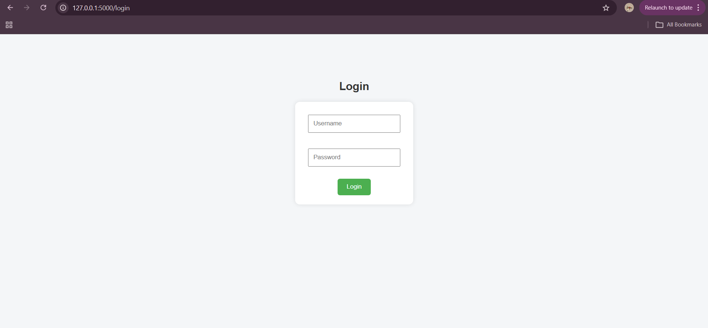
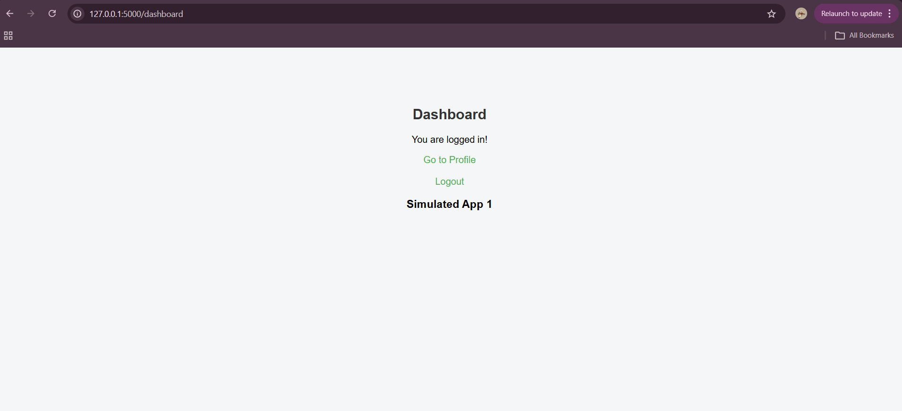
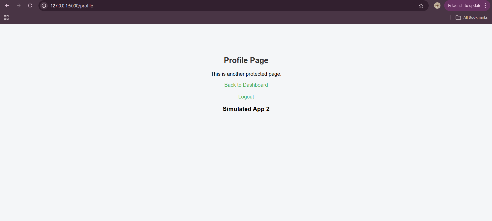

# SSO Simulation System

A basic Single Sign-On (SSO) simulation system built using Flask to understand authentication, session handling, and access control.

## 🚀 Features
- User login authentication
- Session-based access control
- Access multiple pages without re-login
- Logout functionality with session clearing

## 🛠 Tech Stack
- Python (Flask)
- HTML, CSS

## 🧠 What I Learned
- How authentication systems work
- Session management in web applications
- Basics of Identity & Access Management (IAM)
- How SSO enables seamless access across multiple services

## 📌 Future Improvements
- Implement JWT-based authentication
- Add OAuth / Google login simulation
- Role-based access control (RBAC)
- Database integration (SQLite/MySQL)

## ▶️ How to Run
1. Clone the repo  
2. Run: `python app.py`  
3. Open browser at `http://127.0.0.1:5000`

## 📸 Screenshots

### Login Page

### Dashboard

### Profile Page

   
